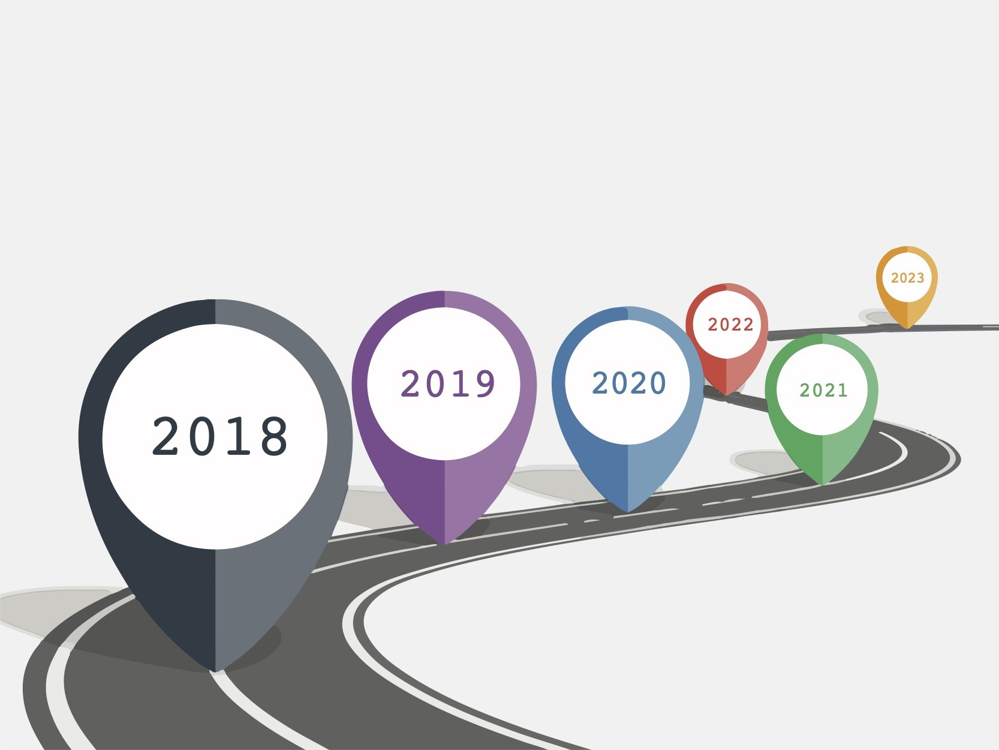

* February 2018 - attempt  to learn game-development with C#.
* March 2018 - December 2019 - HTML, CSS (creating basic website with tags: div, p, a, article, aside, footer, header and other).
* December 2019 - begin my programming way with Python.
* January 2020 - start of learning JavaScript programming language.
* February 2020 - start of reading book ["JavaScript: The Definitive Guide: Activate Your Web Pages 5th edition"](https://www.amazon.com/JavaScript-Definitive-Guide-Activate-Guides/dp/0596805527) and [https://learn.javascript.ru/](https://learn.javascript.ru/).
* June 2020 - finish of reading book. 
* June 2020 - first JavaScript application with jQuery.
* July 2020 - read book about HTML and CSS, learn CSS-preprocessor (SASS/SCSS).
* August 2020 - October 2020 - start of learning [ReactJS](https://ru.reactjs.org/docs/getting-started.html) and [Redux](https://redux.js.org/).
* October 2020 - first look to the backend technologies, such as [NodeJS](https://nodejs.org/ru/), [Express](https://expressjs.com/ru/), [MongoDB](https://www.mongodb.com/), [Mongoose](https://mongoosejs.com/), [Firebase](https://firebase.google.com/)
* November 2020 - wrote a blog site with [NextJS](https://nextjs.org/).
* December 2020 - learn about [GraphQL](https://graphql.org), [Apollo GraphQL](https://www.apollographql.com/), [TypeScript](https://www.typescriptlang.org/), [GatsbyJS](https://www.gatsbyjs.com/docs/quick-start/).
* January 2021 - [Angular](https://angular.io/docs), [RxJS](https://rxjs-dev.firebaseapp.com/guide/overview) and [yarn](https://yarnpkg.com/).
* February 2021 - learn about [NestJS](https://nestjs.com/), [socket.io](https://socket.io/), [PostgreSQL](https://www.postgresql.org/), [TypeORM](https://typeorm.io/#/), [VueJS](https://v3.vuejs.org/), [Vuex](https://vuex.vuejs.org/) and [Lerna](https://lerna.js.org/) (create chat application, [code here](https://github.com/vitaliyirtlach/chat-app)).
* March 2021 - first look [Docker](), [CircleCI]().
* April 2021 - create simple bot with [Discord.js](https://discord.js.org/#/) (20+ commands). First usage of [ESLint](https://eslint.org/), [TSLint](https://palantir.github.io/tslint/), [Jest](https://jestjs.io/docs/getting-started), [TSJest](https://kulshekhar.github.io/ts-jest/), [Prettier](https://prettier.io/). Github hooks - [Husky](https://typicode.github.io/husky/#/?id=monorepo). Create basic UI Library with [Storybook](https://storybook.js.org/).
* May 2021 - have practice with [Fastify](https://www.fastify.io/), [PassportJS](http://www.passportjs.org/).
...